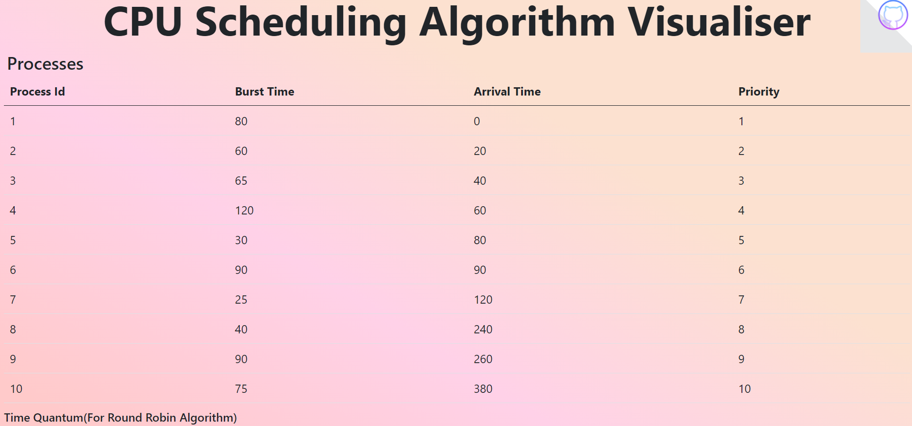
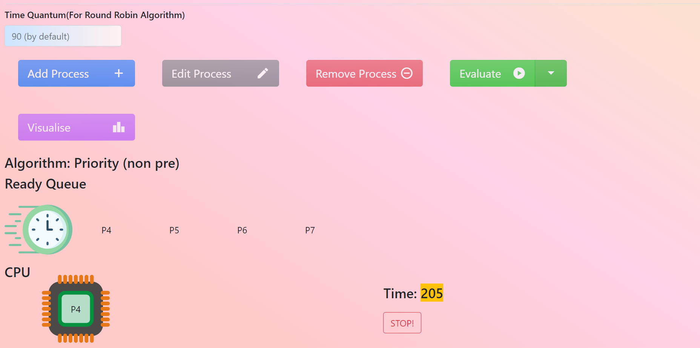

#CPU-Scheduling-Algorithm-Visualizer-

CPU Scheduling Algorithm Visualizer Visualize 9 classic CPU scheduling algorithms
1) First come first serve
2) Shortest Job First
3) Shortest Job First Preemptive
4) Longest Job First
5) Longest Job First Preemptive
6) Round Robin Scheduling
7) Priority
8) Priority Preemptive
9) A new algorithm(Proposed Algorithm), a mixture of SJF, Priority, and Round Robin based on recent research

Features Gantt charts, process details, and performance metrics.

Report_Paper_Link for Proposed Algorithm = https://www.researchgate.net/publication/49619229_An_Improved_Round_Robin_Schedduling_Algorithm_for_CPU_Scheduling

 
 
<h3>Home Page UI</h3>
 

 
 
<h3>Department Section UI</h3>
 
 

                           
